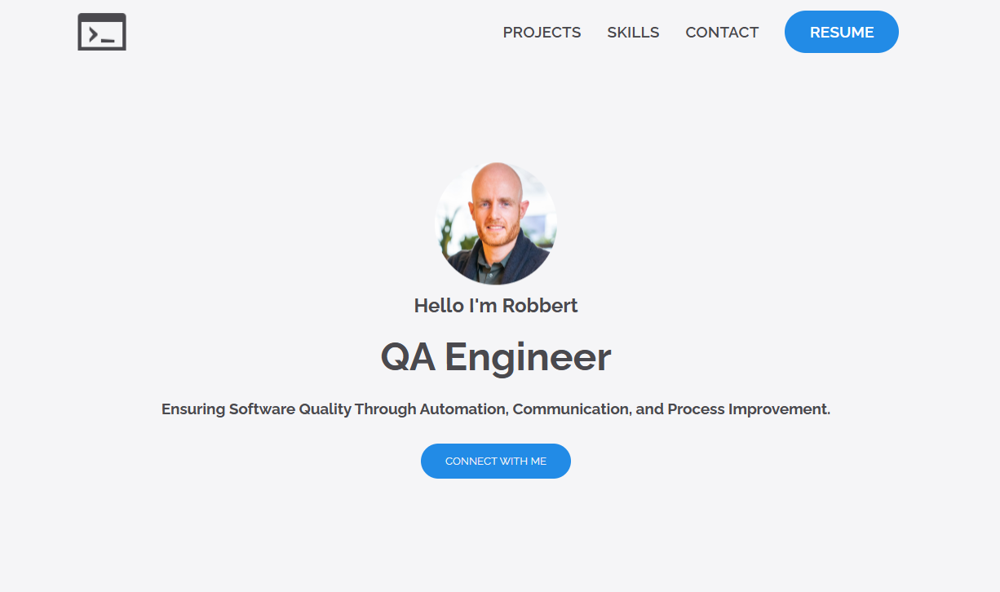
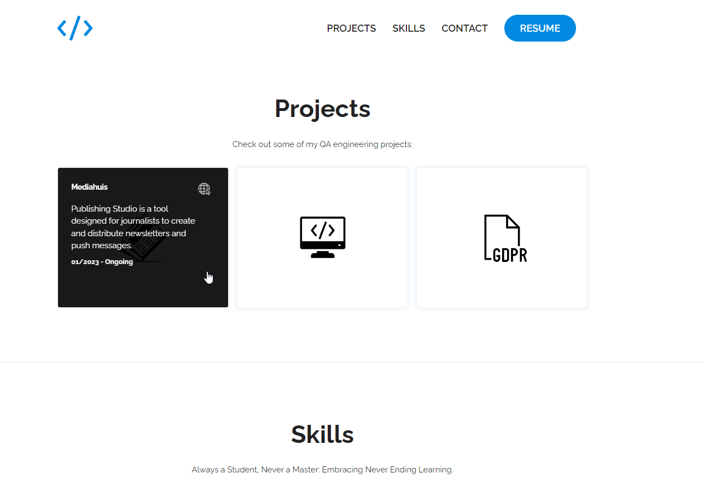
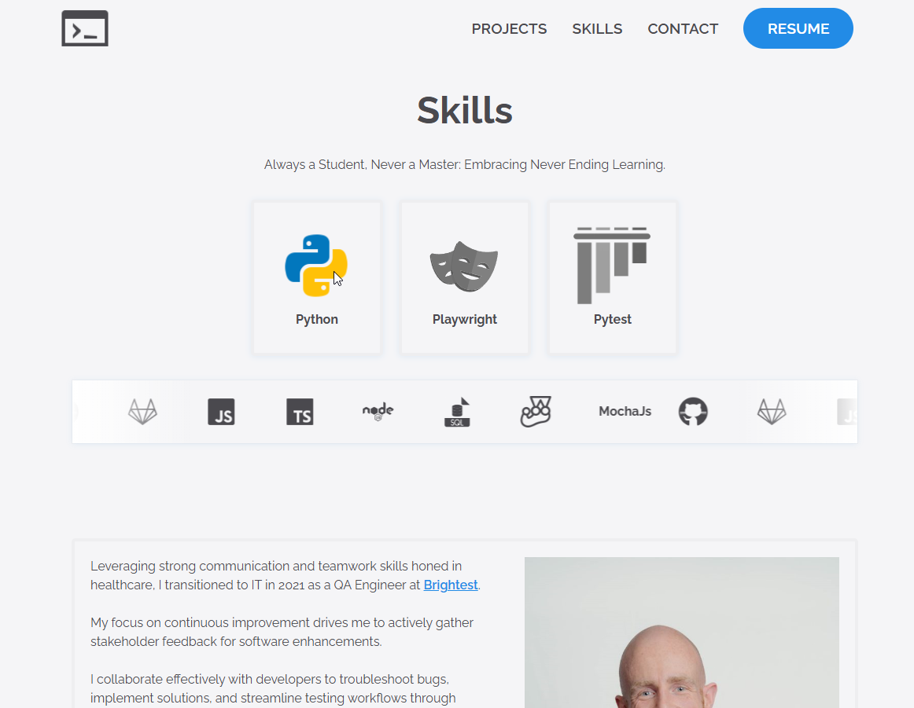

## My Portfolio-website

This repository showcases my professional experience and skills through a user-friendly and responsive portfolio website.

[https://www.robbertchampagne.com](https://www.robbertchampagne.com)

### About

This portfolio website is designed to provide a comprehensive overview of my professional journey, including my skills, projects, and experiences. 
It serves as a digital resume and a platform to showcase my work to potential employers and collaborators.

### Features

- **Responsive Design**: The website is fully responsive and works seamlessly on all devices, including desktops, tablets, and mobile phones.
- **Interactive UI**: Engaging and interactive user interface to enhance user experience.
- **Project Showcase**: Detailed descriptions of my projects, including links.
- **Skills**: A comprehensive list of my professional skills and proficiencies.
- **Contact Information**: Detailed contact information to allow visitors to get in touch with me directly.
- **Blog Section**: (`Still under construction 🚧` ) A blog section where I share my thoughts on various topics related to my field of expertise.

 

